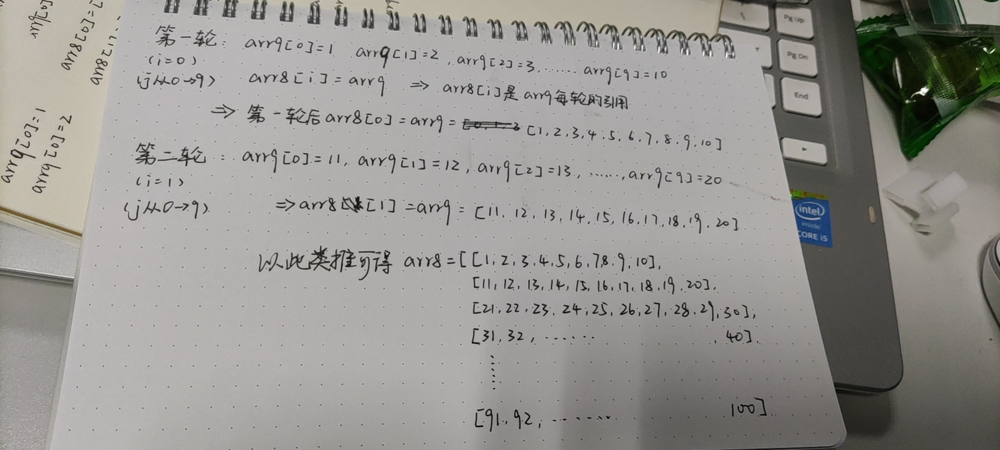

1. 

```js
var arr8 = [];
for (var i = 0; i < 10; i++) {
    var arr9 = [];
    for (var j = 0; j < 10; j++) {
        arr9[j] = i * 10 + j + 1;
    }
    arr8[i] = arr9;
}
console.log(arr8);
```




2. 

```js
function test(person) {
    person.age = 26
    person = {
        name: 'yyy',
        age: 30
    }
    return person
}
const p1 = {
    name: 'yck',
    age: 25
}
const p2 = test(p1)
console.log(p1)
console.log(p2)
```


3. ### 斐波那契数列

```js
var arr = [1, 2];
for (var i = 2; i < 100; i++) {
    arr[i] = arr[i-2] + arr[i-1];
}
console.log(arr);
```


4. 

```js
var arr5 = [1, 2, 3, 4, 5, 6, 7];

console.log(arr5.splice(-5, -2, 'a', 'b', 'c'));

console.log(arr5);
```


5. 当参数为负值时,表示按从右到左的顺序进行定位,即倒数定位法,而不再按正数顺序定位(从左到右),但取值顺序依然是从左到右,如果起始下标值大于或等于结束下标值,将不执行任何操作

```js
var arr1 = [1,2,3,4,5,6,7,8];
console.log(arr1.slice(-3,6));
console.log(arr1.slice(-6,5));
```


6. 

```js
var arr = [1, 2, 4, 3, 22, 34, 32, 34, 100];
arr.sort(function (a, b) {
    console.log(a, b);
    if(a > b) {
        return 1;
    } else if (a < b) {
        return -1;
    } else {
        return 0;
    }
});
arr.sort(function (a, b) {
    return a - b;
})
console.log(arr);
```


7. 

```js
var name = 'world!';
(function () {
    if (typeof name === 'undefined') {
        var name = 'Jack';
        console.log('Goodbye' + name);
    } else {
        console.log('Hello' + name);
    }
})();
```


8. 数组转对象

```js
var url = "http://www.baidu.com?username=xiaowang&password=12345&age=18&sex=女&score=90";

var obj = {};
var strArr = url.split("?");
var strArr2 = strArr[1].split("&");
for  (var i = 0; i < strArr2.length; i++) {
    obj[strArr2[i].split('=')[0]] = strArr2[i].split("=")[1];
}
console.log(obj);
```


9. 

```js
var a = {
    n: 1
};
var b = a;
a.x = a = {
    n: 2
};
console.log(a.n, b.n)
console.log(a.x, b.x);
```


10. 

